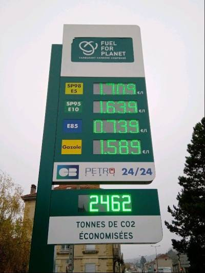

## La newsletter green, super green

Bonjour les colibris. Ce 8 décembre, c’est la journée mondiale du climat. On ressort les cotillons en cartons recyclés pour fêter l’effondrement de la biodiversité et notre avenir sur terre en suspens, youpi !

Nous vous souhaitons une bonne lecture du 9è numéro de cette newsletter collaborative, fruit d’une veille collective de la communauté Techologie.

## 1024 nuances de green

De la communauté Techologie, on était nombreux au 1er [Green Tech Forum](https://www.greentech-forum.com/&sa=D&source=editors&ust=1638912633202000&usg=AOvVaw1V9ZJCDqq66idLyi_f33Kf), la grande messe d’un “numérique plus responsable”. Florilèges des choses vues ou entendues.

Masterclass de Cédric O, secrétaire d’État au numérique, son discours étant le cas d'école du techno-solutionnisme et cela a bien évidemment irrité la salle.

Le responsable RSE de Microsoft France a dit « on appuie sur l’éco anxiété des employés en leur faisant lire Comment tout peut s’effondrer de Pablo Servigne ».

Beaucoup d’anglicismes. « Planet centric design » et « démarche sustainability »… Les grandes ESN qui disent simplement d'ajouter un critère “Sustainability” en monocritère GES / carbone dans les dashboards pour avoir une médaille en chocolat.

Un débat sur quel langage de programmation est plus efficient qu’un autre qui a tourné court. Tant mieux. Débats et discussions aussi autour de l’ouverture ou le coût des données (et quelles données ?) de NegaOctet.

Rencontre entre deux congressistes : « quand on a su qu’on était tous les deux sur Techologie, on est passé du vouvoiement au tutoiement direct ».

Tout de même un point notable sur l’organisation des tables rondes : cet événement laissait aussi la parole à des acteurs engagés du numérique responsable (dont de nombreux membres de la communauté Techologie) et pas uniquement à ceux pour qui ce sujet n’est qu’un business.

Gilles Babinet, [champion européen du numérique](https://www.economie.gouv.fr/rp/gilles-babinet-nomme-digital-champion&sa=D&source=editors&ust=1638912633203000&usg=AOvVaw20EWpLEPVBSIjGsntg5WhE), seul, sans contradicteur (à part l’audience) en keynote de fin d’évènement, servir la soupe habituelle des nouvelles technologies c’est formidable, c’est la solution / la France en retard / il faut accélérer / mettre de l’iOT partout / l’industrie 4.0 / les voitures autonomes / la smart city / le bâtiment intelligent / le chauffage intelligent / la litière pour chat intelligente / les agriculteurs ont besoin de la 5G pour améliorer leur rendement (bah voyons, principalement dans l’agriculture intensive et hyper technologique déjà)...

Bon, sinon, le green tech forum c’était bien pour au moins une (ou la seule) chose : voir ou revoir les copains et les copines. Il se dit que le prochain vrai green tech forum se met vraiment au vert en s’installant au printemps à Bourg-en-Bresse. Info ou intox ?

## L’entretien

Fanny Verrax, philosophe, enseignante et chercheuse qui a répondu à nos questions lors d’un épisode plein de bonne humeur et de philosophie intitulé “[On n'arrête pas le progrès ?](https://soundcloud.com/techologie/58-on-narrete-pas-le-progres-avec-fanny-verrax&sa=D&source=editors&ust=1638912633205000&usg=AOvVaw3I1XZeczTBGO61cHwr9Alv)” a gentiment accepté de compléter l’échange avec une question bonus :

Quelle(s) place(s) de la philosophie dans la transition écologique ?

À mon sens, la philosophie comme discipline et comme boîte à outils est essentielle dans le contexte de l'Anthropocène et de la nécessaire transformation de nos sociétés, parce qu'elle aide à poser les bonnes questions, et parfois même, à y répondre ! Revenons un instant sur l'une des figures les plus emblématiques de la philosophie continentale, Emmanuel Kant. Le philosophe allemand identifie dans un texte très célèbre trois questions fondamentales de la philosophie: Que puis-je connaître ? Que dois-je faire ? Que m'est-il permis d'espérer ?

La première question est la question fondamentale de l'épistémologie, et on voit sans peine les applications que l'on peut en tirer dans le domaine de la science climatique et des sciences environnementales plus généralement. L'épistémologie interroge la notion de preuve, les liens de causalité, la définition de l'incertitude, etc. Pour donner un exemple très précis de l'apport de l'épistémologie, je citerai la philosophe des sciences Naomi Oreskes, qui montre que l'obsession de la science moderne a été d'éviter les erreurs de type II (acceptation erronée d'une hypothèse fausse), quitte à multiplier les erreurs de type I (rejet erronée d'une hypothèse vraie). Le fait que la science climatique ait mis des dizaines d'années à s'imposer est en partie lié à ce biais épistémologique, et il est très utile de l'identifier.

La deuxième question, "Que dois-je faire?", est la question centrale de l'éthique. Pour le dire rapidement, elle permet d'ajouter au "comment" des ingénieurs de la transition le "pourquoi" des philosophes. Chez Kant, la façon la plus rapide de répondre à cette question est de suivre l'impératif catégorique : "Agis toujours de façon à ce que la maxime qui préside à ton action soit universalisable." Au niveau individuel, faut-il arrêter de prendre l'avion ? Aller voter ? Se déplacer à vélo plutôt qu'en voiture ? Réduire drastiquement sa consommation de viande ? À toutes ces questions, l'impératif catégorique de Kant permet de répondre par l'affirmative.

La troisième question enfin, "Que m'est-il permis d'espérer ?", renvoie pour Kant à la religion, mais je propose aujourd'hui de rattacher cette question plutôt à la philosophie politique. C'est la question qui permet de négocier avec le réel et avec le niveau collectif, une fois que j'ai identifié ce que je peux connaître et ce que je dois faire. C'est dans ce cadre par exemple qu'on pourra interroger la pertinence du vote utile.

Pour conclure, je précise que l'exercice que nous venons de faire avec Kant aurait pu être fait avec d'autres philosophes, d'autres écoles de pensée, qui chacune aurait apporté un éclairage différent, et à mon sens tout aussi essentiel.

## Greenwashing, greenwashing, you rince it 3 times, you smell, it smells like a [flower](https://www.youtube.com/watch?v%3DP-qOurzN_Gs&sa=D&source=editors&ust=1638912633207000&usg=AOvVaw2-pih--0RR0wXXr6k7_kXj)

Il y a de nombreux candidats pour cette rubrique greenwashing. Mais un champion sort clairement du lot. Il s’agit de "[Fuel for the planet](https://fuelforplanet.com/&sa=D&source=editors&ust=1638912633208000&usg=AOvVaw1ZCJlQOon5yvqdBcO1_TC_)", la station essence qui compense les émissions du carburant. Bah oui, plus c’est gros, mieux ça passe. Les gueux ont le sens (ou l’essence ?) de l’humour : “Nous sommes le 1er réseau français de station-service qui fait le plein de sens”.

Et si vous en voulez encore, l’association Pour un réveil écologique a lancé [son calendrier de l’avent du greenwashing](https://twitter.com/ReveilEcolo/status/1465983714530369536&sa=D&source=editors&ust=1638912633208000&usg=AOvVaw3vPLkLj4EyuIkPXVoK5Gqi). À consommer sans modération.

## À ne pas manquer

  
À quels enfants allons-nous laisser le monde ?

C’est le titre de l’[entretien avec Philippe Bihouix dans le cadre du 59è épisode de Techologie diffusé ce jeudi 9 décembre à 20h30 sur Imago](https://www.imagotv.fr/inscription/live-radio/techologie/636&sa=D&source=editors&ust=1638912633210000&usg=AOvVaw2vhapk0qDwKPzQxv8Nujgx), le média gratuit de la transition. Si ce nom vous est inconnu, Philippe Bihouix est ingénieur et ses sujets de prédilection sont les limites de la planète, l’épuisement des ressources minérales et énergétiques et les low tech. Auteur de « L'Âge des low-tech », « Le bonheur était pour demain », « Quel futur pour les métaux ? » et co-auteur avec Karine Mauvilly de « Le désastre de l’école numérique, plaidoyer pour une école sans écran ». Venez discuter pendant et après l’épisode (inscription nécessaire).

## Avant de se quitter

*   [Explications sur l'empreinte environnementale du secteur numérique](https://gauthierroussilhe.com/post/explication-empreinte.html&sa=D&source=editors&ust=1638912633211000&usg=AOvVaw1Dv2g82v_tb-a49Pb26co6) par Gauthier Roussilhe.
*   [Les FrameWork JS ce n’est pas (forcément) pour tout le monde](https://bertrandkeller.info/2021/11/17/frameworkJS-contresens/&sa=D&source=editors&ust=1638912633212000&usg=AOvVaw0MptpKjTkYaqHXd0xs4B5M), une réflexion de Bertrand Keller sur le gaspillage et les choix irraisonnés dans le développement frontend.
*   Un [article très complet sur l’évaluation de l’empreinte environnementale de la fabrication d’un serveur](https://boavizta.org/blog/empreinte-de-la-fabrication-d-un-serveur&sa=D&source=editors&ust=1638912633213000&usg=AOvVaw2Jtintmd7iiGxfUCVAL0eT) par boavizta.org
*   [Upcycling Android](https://fsfe.org/activities/upcyclingandroid/&sa=D&source=editors&ust=1638912633214000&usg=AOvVaw3RRdUaL8rCgzKHf0djw-_P) avec une [jolie vidéo explicative sur l’obsolescence induite par Android](https://media.fsfe.org/w/kGvs3JNADvvQfkC1dR9FGr&sa=D&source=editors&ust=1638912633214000&usg=AOvVaw1gQHCOUTmbDRNoMrxVXQdD).
*   [Lowww](https://lowww.directory/&sa=D&source=editors&ust=1638912633215000&usg=AOvVaw0rAVkzY-mOPVRSgz2muH5z), c’est une sélection des plus beaux sites “low-tech”.
*   En Estonie, des [robots livreurs patinent dans la neige](https://twitter.com/UrbanFoxxxx/status/1466782775244111872&sa=D&source=editors&ust=1638912633215000&usg=AOvVaw0egUMKhN5J7ttXmwLyhTSH) en boucle infinie. Zut alors, ils seront sans doute mal notés par des consommateurs impatients.
*   Il va falloir que les pays émergents apprennent à [fabriquer nos smartphones plus proprement](https://twitter.com/xaviergorce/status/1461647095392256005?s%3D21&sa=D&source=editors&ust=1638912633216000&usg=AOvVaw1s2MCy2FnysObfwoQcRYgZ). Faites un effort les pauvres, diantre !
*   En tant qu'utilisateur, je veux prouver que je ne suis pas un robot [en entraînant un robot à devenir moins un robot](https://twitter.com/shituserstory/status/1459148103517364233?s%3D21&sa=D&source=editors&ust=1638912633217000&usg=AOvVaw2i9GgmKletm-eI9CHY5CQ3).
*   Où va l’argent du plan de relance ? Par exemple [dans les drones, l’IA et la réalité augmentée](https://acteurspublics.fr/articles/drones-ia-et-realite-augmentee-au-menu-des-experimentations-de-letat&sa=D&source=editors&ust=1638912633217000&usg=AOvVaw3MqE2NQ1_wnDPSQkLYTtrj) qui sont au menu des expérimentations de l’État. Réjouissant.
*   Les [principaux exportateurs de gaz se disent victimes de la "Cancel Culture"](https://gizmodo.com/top-gas-exporters-say-theyre-victims-of-cancel-culture-1848073862&sa=D&source=editors&ust=1638912633218000&usg=AOvVaw2EyCJrOKfGaaZema50zOK1). Calimero n’a qu’à bien se tenir, y’a de la concurrence.

Prenez soin de vous et de vos futurs DEEE, très bonnes et sobres fêtes de fin d’année et à très vite !

_**Supprimer un e-mail, c’est renoncer.**_
