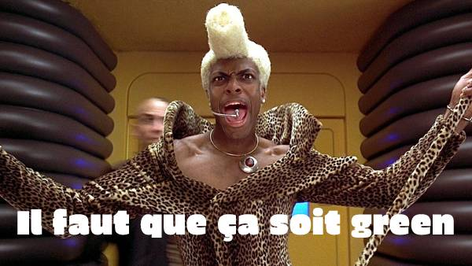

## La newsletter green, super green

Bienvenue et bonne lecture de cette première édition de la newsletter de Techologie, le podcast qui se met à l’écriture. Cette newsletter collaborative est le fruit d’une veille collective de la petite communauté Techologie.

## 1024 nuances de green

Sur le front de l’allongement de la durée de vie des équipements numériques, vient de paraître le [décret relatif à l'obligation d'acquisition par la commande publique](https://www.legifrance.gouv.fr/jorf/id/JORFTEXT000043231546) de biens issus du réemploi ou de la réutilisation ou intégrant des matières recyclées. Il vient en application de l’article 58 de la loi AGEC relative à la lutte contre le gaspillage et à l'économie circulaire. Pour les téléphones mobiles, les téléphones fixes, les ordinateurs portables ou de bureau entre autres, l’État doit maintenant se fournir à 20% en produits réemployés ou intégrant des matières recyclées. À ce sujet, une réflexion intéressante de [Benjamin Bayart](https://twitter.com/bayartb/status/1364658036669894663?s=20) : “la cible du reconditionné, ce sont les gens qui n'ont pas les thunes pour du neuf. Si ce marché est aspiré par la commande publique, les prix vont monter, et empêcher qu'il se développe chez les particuliers”. 

Réemployer, allonger la durée de vie des équipements, c’est aussi réparer, autant que possible. "Ce qui est courant dans la réparation de smartphone, c'est ce qu'on appelle la cannibalisation, la manière d'utiliser des composants d'un smartphone dans un autre", nous dit Nicolas Nova, anthropologue des technologies et designer-chercheur, [à écouter dans cet épisode de Techologie](https://techologie.net/episodes/45-anthropologie-du-smartphone).

Après le “flygskam”, une “honte de regarder ses vidéos en HD” s'impose-t-elle dans l’opinion publique ? Des amendements ont été déposés par plusieurs députés dans le cadre du projet de loi Climat et Résilience visant à obliger les plateformes à indiquer l’empreinte carbone de chaque vidéo visionnée par leurs utilisateurs. Pour l’instant, ces propositions ont été rejetées par la commission spéciale de l’Assemblée. À trop vouloir faire culpabiliser les usagers, on oublierait presque les vrais responsables, une industrie du numérique qui génère des fortunes avec notre temps de cerveau disponible. [À lire sur Usbek et Rica](https://usbeketrica.com/fr/article/des-deputes-veulent-obliger-les-plateformes-a-afficher-l-empreinte-carbone-de-leurs-videos).

Pénurie, appât du gain et spéculation : certains achètent autant que possible des cartes graphiques pour les revendre plus cher ensuite et vont jusqu’à programmer un automate capable d’acheter le produit dès qu'il est disponible. « Ces achats représentent un tiers des commandes de cartes graphiques ». [A lire dans le Monde](https://www.lemonde.fr/pixels/article/2021/03/09/cinq-questions-sur-la-penurie-historique-des-consoles-et-cartes-graphiques_6072511_4408996.html). Dans la même thématique, à lire aussi cet article “[La bataille des semi-conducteurs](https://www.greenit.fr/2021/03/09/la-bataille-des-semi-conducteurs/)” sur greenit.fr

## L’entretien

**Bela Loto** est cofondatrice de l’association [Point de M.I.R.](https://www.point-de-mir.com/), Maison de l’Informatique Responsable.

**Tu travailles sur la sensibilisation du grand public aux impacts environnementaux du numérique. Quel a été le déclic ?**

C’est lorsqu’en 2012, j'ai visionné le film de Coline Tison et Laurent Lichtenstein, “L'Internet, la pollution cachée”. C'est un excellent documentaire qui permettait de comprendre que le numérique n'est absolument pas immatériel. Je découvrais la lourdeur des infrastructures qui soutiennent Internet. Cela a été un bouleversement total. Ce documentaire parle beaucoup de data centers mais les choses ont beaucoup évolué depuis, notamment en termes d'efficience énergétique. Cependant, il n'en reste pas moins vrai que l'immatérialité promise par Internet est toujours aussi dépendante d’un monde au contraire très matériel. Donc le propos est toujours aussi intéressant, toujours aussi pertinent. Et ça a changé ma vie.

**As-tu des bonnes pratiques en vue d’un numérique plus responsable ?**

Des bonnes pratiques ou des meilleures pratiques, il y en a dans différents domaines. Il y a des bonnes pratiques dans l'impression, dans la gestion de l'énergie de son matériel, dans la navigation, dans la messagerie. Le premier éco-geste à retenir, c'est celui d’allonger la durée de vie de son matériel. C'est le plus difficile à mettre en place malheureusement mais c'est celui qui est vraiment le plus important. Pour cela, il faut apprendre à allonger cette durée de vie. Ce n'est pas évident. Par exemple, par l'entretien et la maintenance. De plus, il faut se poser des questions sur l'acquisition d’équipements neufs. Avant d’acheter neuf, si on réussit à faire durer deux ans de plus l’équipement existant, on ne passe pas par la case achat. Aussi, on peut éventuellement se passer d'acheter mais louer par exemple.

**Il y a des éléments techniques pour allonger la durée de vie ? On sait par exemple pour les smartphones que quand on met à jour l'OS, ça rame.**

Je dirais qu'il faut faire les mises à jour de sécurité. Par contre, pour les mises à jour évolutives, ce n'est pas utile. Cela peut ralentir la machine ou créer une incompatibilité. Il n’est pas toujours possible de n’avoir à disposition que les mises à jour de sécurité. Il y a des associations et des ONG comme Halte à l'Obsolescence Programmée qui travaillent sur ces questions là et qui font du lobbying dans le bon sens. Il faut arriver à faire comprendre aux fabricants qu'ils changent leurs usages. Personnellement, j'ai fait un choix peut-être radical. Je n'ai pas d'applications tierces sur mon téléphone. Donc la question des mises à jour ne se pose pas !

[Écouter l’intégralité de notre échange avec Bela Loto](https://techologie.net/episodes/7-se-sensibiliser-au-numerique-responsable.html).

## Greenwashing, greenwashing, you rince it 3 times, you smell, it smells like a flower

Dans une publication promo sur Linkedin avec une vidéo à l’appui, on “chasse le carbone des serveurs” avec un laptop représenté affublé d’un pot d’échappement. Mais le vrai message, il est ailleurs. C’est encore une fois aux pauvres usagers, ici les salariés, la responsabilité de faire attention à ne pas flinguer la planète avec leurs emails ! Assez drôle, lorsqu’on sait l’activité de l’entreprise en question.

## Breaking news

Dans cette interview sur Twitch, la plateforme appartenant à Amazon et de plus en plus prisée par nos politiques, Cédric O veut mettre [du numérique partout pour réduire l’empreinte du numérique](https://www.twitch.tv/videos/942981742). Pas compris ! Vous, si ? Par ailleurs, le sujet de l’empreinte environnementale du numérique dans la loi Climat et Résilience, oui ou non ? [Barbara Pompili et Cédric O ne semblent pas d'accord](https://twitter.com/CommownFR/status/1369623635242192904?s=20). Seule maigre consolation pour l’instant, dans l’article “Education à l’environnement et au développement durable”, [un amendement accepté](https://www.banquedesterritoires.fr/climat-et-resilience-le-projet-de-loi-entre-les-mains-de-la-commission-speciale-lassemblee) prévoit pour les élèves, "une sensibilisation à l’impact environnemental du numérique ainsi qu’un volet relatif à la sobriété numérique". Petit pas ambitieux, non ?

Le [guide d’éco-conception de services numériques](https://eco-conception.designersethiques.org/guide/) par l’association Designers Éthiques est là ! Une bonne entrée en matière, avec des exemples concrets, pour mettre en place une démarche d’éco-conception dans vos beaux projets numériques. Cela ne sent pas le pain chaud mais presque.

Le designer-chercheur Gauthier Roussilhe a eu l’audace de questionner les études qui démontrent que le numérique permet d’éviter des émissions CO² d’autres secteurs. Le numérique permet-il réellement en émettant 1g eq CO² d’en éviter 10 dans d’autres secteurs ? À lire ici : [Que peut le numérique pour la transition écologique ?](https://gauthierroussilhe.com/pdf/NTE-Mars2021.pdf)

Votre soif de lecture n’est pas rassasiée ? Les gens de [TechTrash](https://www.techtrash.fr/) lancent [Climax](https://www.kisskissbankbank.com/fr/projects/climax-la-newsletter-plus-chaude-que-le-climat), une nouvelle newsletter, plus chaude que le climat. Ça promet !

## Avant de se quitter

Un peu de dissonance cognitive saupoudrée d’obsolescence imposée ? Il faut avoir [un iPhone 7 minimum pour utiliser l’appli Yuka](https://twitter.com/arnaudforaison/status/1351817712662667265).

“Une dizaine d'intelligences artificielles et une douzaines de consciences virtualisées avaient péri dans l'incendie du data center. Ce furent les premiers morts virtuels de l'histoire. Un monument fut rapidement érigé à leur mémoire.” Le meilleur tweet sur l’incendie du datacenter d’OVH revient à [Mykrodystopie](https://twitter.com/mikrodystopies/status/1369575789071638535?s=20).

RGPD : sans surprise, 90% des plateformes de consentement [utilisent des dark patterns](https://arxiv.org/abs/2001.02479) pour vous forcer à cliquer sur le bouton “accepter”.

Pendant ce temps, le Figaro magazine, tranquille, met en une « [Comment tirer profit de la crise](https://twitter.com/VinceJarousseau/status/1368491408965971969/photo/1) ». Ils ne déçoivent jamais.

“Si le capitalisme de plateforme est à ce point encensé par les investisseurs, ce n'est pas pour leurs innovations technologiques mais plutôt pour avoir réussi à renforcer l'exploitation des travailleurs, en s'affranchissant notamment du droit du travail.”, via [Cerveaux non disponibles](https://twitter.com/CerveauxNon/status/1369282122981203972?s=20).

Nous espérons que vous avez apprécié cette 1ère édition de notre newsletter. Pour nous donner un coup de pouce, [partagez-la sur le réseau au logo d’oiseau](https://twitter.com/intent/tweet?text=Je recommande la lecture de la dernière newsletter de Techologie : https://techologie.net/newsletter/1) ou sur celui de votre choix.

Si vous avez moins aimé (vous avez le droit), pour nous suggérer des améliorations, dites nous tout sur notre [espace dédié](https://join.slack.com/t/techologie/shared_invite/enQtNTMwODc1NTYxNDkxLTMzZWI3NTIwNWUyMzIwMGIyMzY2YmYyNDFiZWMyOWJiMTJjOWRkODg2MWM4Y2M1OWE4Y2Y2MmJiNjQ5NTcwZmM) (slack).

Prenez soin de vous et de vos smartphones et à dans 2 semaines !