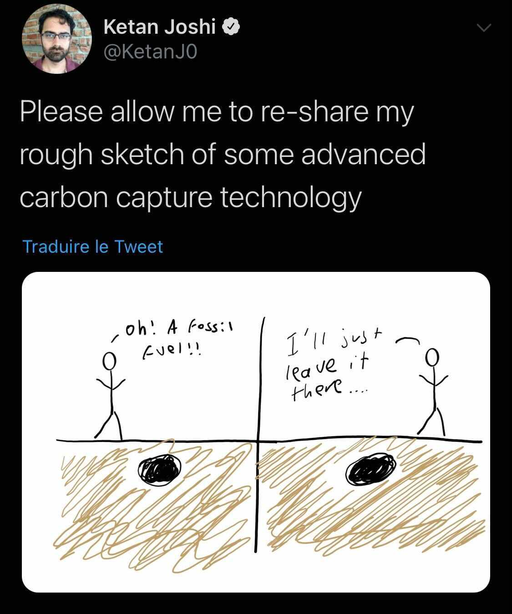

## La newsletter green, super green

mais pas plus green que cette nouvelle technologie de capture du carbone :

par [Ketan Joshi](https://twitter.com/KetanJ0/status/1389532880163020801)

Bonjour les écolo-geeks. Nous vous souhaitons une bonne lecture de ce 5ème numéro de notre newsletter collaborative, fruit d’une veille collective de la communauté Techologie.

## 1024 nuances de green

**Rien ne va plus pour la croissance verte.** C’est l’alerte donnée par un nouveau rapport de l’IEA, l’agence internationale de l'énergie, sur “[le rôle des minéraux critiques dans les transitions vers les énergies propres](https://www.iea.org/reports/the-role-of-critical-minerals-in-clean-energy-transitions&sa=D&source=editors&ust=1620862743562000&usg=AOvVaw3YpFtsOevzdDD7J6WUuWHB)”. Selon un des auteurs, [Fatih Birol](https://twitter.com/fbirol/status/1389807286735056896), il y a “un décalage entre les ambitions climatiques du monde et la disponibilité des minéraux nécessaires à la réalisation de ces ambitions”. Pour lui, “les gouvernements doivent agir maintenant pour réduire les risques de volatilité des prix et de rupture d'approvisionnement”. Pas question encore d’évoquer une quelconque sobriété, mais d’amplifier l’extractivisme.

**Green Tech toniqu**e **pour la République**. L’État se met au vert côté matériel et prestations numériques en sortant son [Guide pratique pour des achats numériques responsables](https://ecoresponsable.numerique.gouv.fr/). En version bêta et assez dru pour le moment, ce guide offre tous les éléments pour s’orienter vers une politique d’achat plus responsable. Glossaire, description des (éco)labels, rappel de la réglementation, fiches thématiques par famille d’achat, c’est une mine d’informations qui permet aux administrations de se poser les bonnes questions avant de passer à la caisse. Si ce guide est à destination des services de l’État, il reprend les bonnes pratiques qui sont amenées à être généralisées.

## L’entretien

Entretien exclusif mais tout à fait fictif avec Elon Musk, ex patron de PayPal et actuel patron de Tesla et SpaceX entre autres.

**Vous venez d’annoncer lors de l’émission Saturday Night Live, être Asperger.**

Oui, c’est bien mon seul point commun avec Greta Thunberg. Je n’adhère pas du tout à son discours catastrophiste. Au contraire. Je prône l’optimisme. Lorsque j’ai découvert Internet en 1995, j’ai trouvé ça _amazing_ pour l’humanité. J’ai tout plaqué pour créer un business dans l’Internet. Et je suis devenu riche. En fait, on a énormément de solutions pour contrer le réchauffement climatique. Par exemple, moi, j’ai créé Tesla pour continuer de rouler toujours plus vite, toujours plus loin, mais de manière plus écologique. Et SpaceX, pour se barrer dans l’espace si ça foire.

**Vous êtes conscients que Mars, ces paysages rouges et désertiques et des températures moyennes de -63°C, ça ne fait rêver personne ?**

Non mais faut savoir. Sur Terre, on est fucked up, you know ? Soit on grille ici, soit on va voir ailleurs. Et puis Mars, c’est juste une étape. On va la terra-former, on a les solutions pour ça. Mais comme sur Terre, on aura vite fait de consommer toutes les ressources de Mars. Puis on ira coloniser une autre planète. Ainsi de suite. C’est l’histoire de l’humanité. Quand les européens se sentaient à l’étroit dans leur vieux continent dont les ressources s’épuisaient, ils ont fait pareil : coloniser l’Afrique, l’Amérique, etc. Et ils ont “terra-former” ces colonies en massacrant les rebelles et en défrichant les terres pour s’octroyer les ressources.

**Quelles relations avez-vous avec notre pays, la France ?**

J’adore la France. You, french people, are funny. Vous êtes le pays des grèves, du minitel et de la chocolatine.

**On dit pain au chocolat. Enfin, pas partout.**

Voilà. Vous seriez prêts à manifester dans la rue pour un sujet aussi futile ! Je pense que chacun est libre de nommer cette viennoiserie comme il l’entend. Si je veux appeler cela un “chausson au chocolat”, qui m’en empêcherait ? Bref, j’adore la France. Il parait que chez vous, vous êtes inquiets de l’empreinte environnementale du numérique (rires). Aux United States of America, on voit ça comme un business, un business comme un autre. Et vous french people, vous voyez ça comme une menace. Et vous ne voulez pas de la 5G (fou rire).

**Quels sont vos projets en cours ?**

Le [lance-flamme-chalumeau](https://www.rtl.fr/actu/sciences-tech/elon-musk-vend-des-lance-flammes-a-500-dollars-apres-une-blague-7792046821) n’a clairement pas trouvé son public. On planche maintenant sur le lancement d’un hyperloop toothbrush, une brosse à dent supersonique et bien sûr connectée vous permettant de vous brosser les dents en moins de 10 secondes. C’est un gain de temps quotidien énorme ! Time is money. Ce temps gagné vous permettra par exemple de fonder des startups.

## Greenwashing, greenwashing, you rince it 3 times, you smell, it smells like a [flower](https://www.youtube.com/watch?v%3DP-qOurzN_Gs)

Orange et Publicis lancent un filtre Instagram et Facebook qui ambitionne de réduire l’empreinte environnementale des stories. Ce filtre modestement nommé [Eco-filter](https://www.ladn.eu/adn-business/news-business/actualites-annonceurs/orange-publicis-filtre-photo/) propose une réduction du nombre de pixels des photos et vidéos ce qui allège le poids de ces médias d’environ 20%. Le point positif c’est la sensibilisation du grand public sur l’impact environnemental des usages numériques. Cependant, compte tenu des activités d’Orange et de Publicis, c’est reporter encore une fois la responsabilité sur les utilisateurs, à coup de grande communication et [vidéo à l’appui](https://www.youtube.com/watch?v%3DTDo9jx_7q0U). Tout cela pour un usage fort peu essentiel, voire futile. La vidéo se termine par ce message : “A little goes a long way”, un peu peut mener loin. Est-ce une invitation à aller utiliser de l’eco-filter en vacances à Bali ?

## À ne pas manquer

Le numérique est loin d’être dématérialisé. Au contraire, on creuse, on creuse pour extraire les matières nécessaires. Et souvent dans des conditions inhumaines. Il faut le voir pour le croire. Un journaliste français en a fait l’expérience, [en filmant dans les mines de coltan au République Démocratique du Congo](https://youtu.be/IPjur249dKg). Ironie du sort, les ouvriers, souvent très jeunes, utilisent leurs téléphones portables pour s’éclairer dans la mine.

Du côté de l’assemblage de nos joujoux numériques, pas mieux. Face à la dégradation catastrophique de leurs conditions de travail, les ouvriers de Wistron, un sous-traitant d’Apple en Inde, [ont saccagé leur usine](https://www.greenit.fr/2021/05/04/emeutes-chez-wistron-un-revelateur-de-problemes-systemiques/) en décembre dernier. De quoi rappeler les luddistes, ces ouvriers anglais du 19è siècle qui détruisaient les machines pour protéger leurs emplois.

Quelles solutions à ce désordre global ? Déserter et entrer en résistance par exemple. Ne ratez pas la 50è du podcast Techologie avec l’échange avec Romain Boucher : “[data sciences, techno-libéralisme et désertion de l’ingénierie](https://www.imagotv.fr/podcasts/techologie/50)”.

# Avant de se quitter

C’est fin mai que la Commission du développement durable et de l’aménagement du territoire [examinera la proposition de loi visant à réduire l’empreinte environnementale du numérique en France](https://www.nextinpact.com/article/45668/les-pistes-legislatives-pour-verdir-numerique) adoptée le 12 janvier au Sénat.

Pas d’emplois sur une planète morte : [25 propositions pour “sauver le climat et créer des emplois”](https://plus-jamais.org/2021/05/06/pas-d-emploi-sur-une-planete-morte/).

Les démarches adoptées en matière de numérique et d’Internet lorsqu’[on vit en autonomie sur un bateau](https://100r.co/site/working_offgrid_efficiently.html).

Si vous êtes l’heureux propriétaire d’une voiture Tesla, vous pouvez utiliser l'application mobile dédiée pour [faire fondre la neige sur votre voiture](https://twitter.com/Tesla/status/1366448694111973381?s%3D20) avant même de quitter la maison. Elle est pas belle la vie bas carbone ?

French Tech for the planet : [20 startups de la transition écologique](https://www.maddyness.com/2021/05/03/french-tech-20-startup-transition-ecologique/) sélectionnées et choyées par Cédric O et Barbara Pompili.

L'ancienne équipe rédactionnelle de Science & Vie lance un nouveau magazine scientifique appelé [Espiloon](https://fr.ulule.com/epsiloon/).

La maison brûle et nous regardons ailleurs. Cette citation de Jacques Chirac pourrait être le parfait résumé de ce très joli court-métrage... [Thermostat 6](https://www.imagotv.fr/courts-metrages/thermostat-6/film/1).

**Pour nous montrer que vous avez apprécié votre lecture et pour nous donner un coup de pouce, [partagez-la sur le réseau au logo d’oiseau](https://twitter.com/intent/tweet?text%3DJe%2520recommande%2520la%2520lecture%2520de%2520la%2520derni%25C3%25A8re%2520newsletter%2520de%2520Techologie%2520:%2520https://techologie.net/newsletter/5), sur un [réseau pro aux gens chelous](https://www.linkedin.com/sharing/share-offsite/?url%3Dhttps://techologie.net/newsletter/5) ou sur celui de votre choix.

Pour nous suggérer des améliorations, dites nous tout sur notre [espace dédié](https://join.slack.com/t/techologie/shared_invite/enQtNTMwODc1NTYxNDkxLTMzZWI3NTIwNWUyMzIwMGIyMzY2YmYyNDFiZWMyOWJiMTJjOWRkODg2MWM4Y2M1OWE4Y2Y2MmJiNjQ5NTcwZmM) (slack).

Prenez soin de vous et de vos smartphones et à dans 2 semaines !

_N’imprimez cet e-mail qu’en heure creuse._
